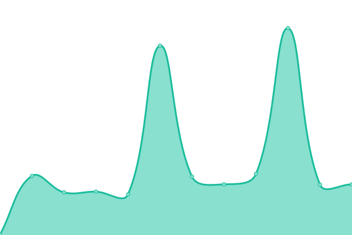
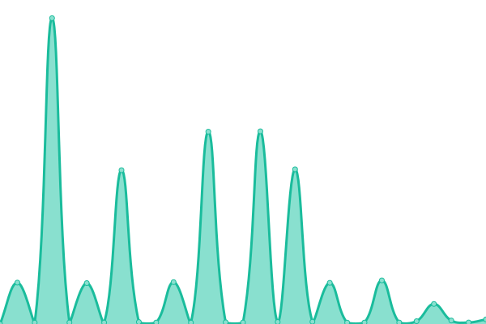

# [📈 Live Status](https://status.feiert.ag): <!--live status--> **🟧 Partial outage**

This repository contains the open-source uptime monitor and status page for [Feiert.ag Eventkommunikation](https://www.feiert.ag), powered by [Upptime](https://github.com/upptime/upptime).

With [Upptime](https://upptime.js.org), you can get your own unlimited and free uptime monitor and status page, powered entirely by a GitHub repository. We use [Issues](https://github.com/Feiert-ag/status/issues) as incident reports, [Actions](https://github.com/Feiert-ag/status/actions) as uptime monitors, and [Pages](https://status.feiert.ag) for the status page.

<!--start: status pages-->
<!-- This summary is generated by Upptime (https://github.com/upptime/upptime) -->
<!-- Do not edit this manually, your changes will be overwritten -->
<!-- prettier-ignore -->
| URL | Status | History | Response Time | Uptime |
| --- | ------ | ------- | ------------- | ------ |
|  [Feiert.ag](https://Feiert.ag) | 🟩 Up | [feiert-ag.yml](https://github.com/Feiert-ag/status/commits/HEAD/history/feiert-ag.yml) | 

 526ms
     
 | 

<a href="https://status.feiert.ag/history/feiert-ag">99.77%</a>
    

|  [www.Feiert.ag (Redirect)](https://www.Feiert.ag) | 🟩 Up | [www-feiert-ag-redirect.yml](https://github.com/Feiert-ag/status/commits/HEAD/history/www-feiert-ag-redirect.yml) | 

 260ms
     
 | 

<a href="https://status.feiert.ag/history/www-feiert-ag-redirect">99.93%</a>
    

|  [Feiert.ag:80 (Redirect)](http://Feiert.ag) | 🟩 Up | [feiert-ag-80-redirect.yml](https://github.com/Feiert-ag/status/commits/HEAD/history/feiert-ag-80-redirect.yml) | 

 34ms
     
 | 

<a href="https://status.feiert.ag/history/feiert-ag-80-redirect">99.94%</a>
    

|  [CalDB.de (Public)](https://CalDB.de) | 🟥 Down | [cal-db-de-public.yml](https://github.com/Feiert-ag/status/commits/HEAD/history/cal-db-de-public.yml) | 

 570ms
     
 | 

<a href="https://status.feiert.ag/history/cal-db-de-public">100.00%</a>
    

|  CalDB.de (Webserver) | 🟥 Down | [cal-db-de-webserver.yml](https://github.com/Feiert-ag/status/commits/HEAD/history/cal-db-de-webserver.yml) | 

 0ms
     
 | 

<a href="https://status.feiert.ag/history/cal-db-de-webserver">100.00%</a>
    

|  CalDB.de (SSH) | 🟥 Down | [cal-db-de-ssh.yml](https://github.com/Feiert-ag/status/commits/HEAD/history/cal-db-de-ssh.yml) | 

 0ms
     
 | 

<a href="https://status.feiert.ag/history/cal-db-de-ssh">100.00%</a>
    

|  [www.CalDB.de (Redirect)](https://www.CalDB.de) | 🟥 Down | [www-cal-db-de-redirect.yml](https://github.com/Feiert-ag/status/commits/HEAD/history/www-cal-db-de-redirect.yml) | 

 0ms
     
 | 

<a href="https://status.feiert.ag/history/www-cal-db-de-redirect">100.00%</a>
    

|  [CalDB.de:80 (Redirect)](http://www.CalDB.de) | 🟥 Down | [cal-db-de-80-redirect.yml](https://github.com/Feiert-ag/status/commits/HEAD/history/cal-db-de-80-redirect.yml) | 

 0ms
     
 | 

<a href="https://status.feiert.ag/history/cal-db-de-80-redirect">100.00%</a>
    

|  [Projects-Service: Read](https://CalDB.de/v1/projects/12345678-0000-0000-0000-000000000001) | 🟥 Down | [projects-service-read.yml](https://github.com/Feiert-ag/status/commits/HEAD/history/projects-service-read.yml) | 

 139ms
     
 | 

<a href="https://status.feiert.ag/history/projects-service-read">100.00%</a>
    

|  [Domains-Service: Read](https://CalDB.de/v1/domains/12345678-0000-0000-0000-000000000001) | 🟥 Down | [domains-service-read.yml](https://github.com/Feiert-ag/status/commits/HEAD/history/domains-service-read.yml) | 

 137ms
     
 | 

<a href="https://status.feiert.ag/history/domains-service-read">100.00%</a>
    

|  [Themes-Service: Read](https://CalDB.de/v1/themes/12345678-0000-0000-0000-000000000001) | 🟥 Down | [themes-service-read.yml](https://github.com/Feiert-ag/status/commits/HEAD/history/themes-service-read.yml) | 

 137ms
     
 | 

<a href="https://status.feiert.ag/history/themes-service-read">100.00%</a>
    

|  [Templates-Service: Read](https://CalDB.de/v1/themes/12345678-0000-0000-0000-000000000001) | 🟥 Down | [templates-service-read.yml](https://github.com/Feiert-ag/status/commits/HEAD/history/templates-service-read.yml) | 

 137ms
     
 | 

<a href="https://status.feiert.ag/history/templates-service-read">100.00%</a>
    

|  [Views-Service: Read](https://CalDB.de/v1/themes/12345678-0000-0000-0000-000000000001) | 🟥 Down | [views-service-read.yml](https://github.com/Feiert-ag/status/commits/HEAD/history/views-service-read.yml) | 

 137ms
     
 | 

<a href="https://status.feiert.ag/history/views-service-read">100.00%</a>
    

|  [Views-Service: Write](https://CalDB.de/v1/themes) | 🟥 Down | [views-service-write.yml](https://github.com/Feiert-ag/status/commits/HEAD/history/views-service-write.yml) | 

 213ms
     
 | 

<a href="https://status.feiert.ag/history/views-service-write">64.84%</a>
    

|  [Calendars-Service: Read](https://CalDB.de/v1/calendars/12345678-0000-0000-0000-000000000001) | 🟥 Down | [calendars-service-read.yml](https://github.com/Feiert-ag/status/commits/HEAD/history/calendars-service-read.yml) | 

 137ms
     
 | 

<a href="https://status.feiert.ag/history/calendars-service-read">100.00%</a>
    

|  [Calendars-Service: Write](https://CalDB.de/v1/themes) | 🟥 Down | [calendars-service-write.yml](https://github.com/Feiert-ag/status/commits/HEAD/history/calendars-service-write.yml) | 

 138ms
     
 | 

<a href="https://status.feiert.ag/history/calendars-service-write">0.00%</a>
    

|  [Events-Service: Read](https://CalDB.de/v1/calendars/12345678-0000-0000-0000-000000000001) | 🟥 Down | [events-service-read.yml](https://github.com/Feiert-ag/status/commits/HEAD/history/events-service-read.yml) | 

 138ms
     
 | 

<a href="https://status.feiert.ag/history/events-service-read">100.00%</a>
    

|  [Events-Service: Write](https://CalDB.de/v1/themes) | 🟥 Down | [events-service-write.yml](https://github.com/Feiert-ag/status/commits/HEAD/history/events-service-write.yml) | 

 137ms
     
 | 

<a href="https://status.feiert.ag/history/events-service-write">0.00%</a>
    

|  [Users-Service: Read](https://CalDB.de/v1/users/12345678-0000-0000-0000-000000000001) | 🟥 Down | [users-service-read.yml](https://github.com/Feiert-ag/status/commits/HEAD/history/users-service-read.yml) | 

 138ms
     
 | 

<a href="https://status.feiert.ag/history/users-service-read">100.00%</a>
    

|  [github.com/Feiert.ag](https://github.com/feiert-ag/) | 🟩 Up | [github-com-feiert-ag.yml](https://github.com/Feiert-ag/status/commits/HEAD/history/github-com-feiert-ag.yml) | 

 421ms
     
 | 

<a href="https://status.feiert.ag/history/github-com-feiert-ag">100.00%</a>
    

|  [Reference: Google.com](https://google.com) | 🟩 Up | [reference-google-com.yml](https://github.com/Feiert-ag/status/commits/HEAD/history/reference-google-com.yml) | 

 152ms
     
 | 

<a href="https://status.feiert.ag/history/reference-google-com">100.00%</a>
    

|  [Reference: Cloudflare.com](https://cloudflare.com) | 🟩 Up | [reference-cloudflare-com.yml](https://github.com/Feiert-ag/status/commits/HEAD/history/reference-cloudflare-com.yml) | 

 799ms
     
 | 

<a href="https://status.feiert.ag/history/reference-cloudflare-com">98.07%</a>
    

|  [Reference: Amazon.com](https://amazon.com) | 🟩 Up | [reference-amazon-com.yml](https://github.com/Feiert-ag/status/commits/HEAD/history/reference-amazon-com.yml) | 

 271ms
     
 | 

<a href="https://status.feiert.ag/history/reference-amazon-com">100.00%</a>
    

<!--end: status pages-->

[**Visit our status website →**](https://status.feiert.ag)

## 📄 License

- Powered by: [Upptime](https://github.com/upptime/upptime)
- Code: [MIT](./LICENSE) © [Anand Chowdhary](https://anandchowdhary.com), supported by [Pabio](https://pabio.com)
- Data in the `./history` directory: [Open Database License](https://opendatacommons.org/licenses/odbl/1-0/)
