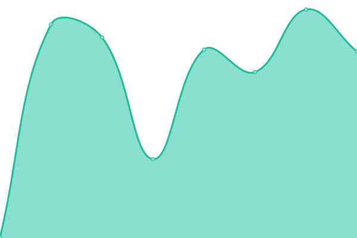

# [📈 Live Status](https://status.feiert.ag): <!--live status--> **🟧 Partial outage**

This repository contains the open-source uptime monitor and status page for [Feiert.ag Eventkommunikation](https://www.feiert.ag), powered by [Upptime](https://github.com/upptime/upptime).

With [Upptime](https://upptime.js.org), you can get your own unlimited and free uptime monitor and status page, powered entirely by a GitHub repository. We use [Issues](https://github.com/Feiert-ag/status/issues) as incident reports, [Actions](https://github.com/Feiert-ag/status/actions) as uptime monitors, and [Pages](https://status.feiert.ag) for the status page.

<!--start: status pages-->
<!-- This summary is generated by Upptime (https://github.com/upptime/upptime) -->
<!-- Do not edit this manually, your changes will be overwritten -->
<!-- prettier-ignore -->
| URL | Status | History | Response Time | Uptime |
| --- | ------ | ------- | ------------- | ------ |
|  [Feiert.ag](https://Feiert.ag) | 🟩 Up | [feiert-ag.yml](https://github.com/Feiert-ag/status/commits/HEAD/history/feiert-ag.yml) | 

 182ms
     
 | 

<a href="https://status.feiert.ag/history/feiert-ag">100.00%</a>
    

|  [CalDB.de](https://CalDB.de) | 🟥 Down | [cal-db-de.yml](https://github.com/Feiert-ag/status/commits/HEAD/history/cal-db-de.yml) | 

 443ms
     
 | 

<a href="https://status.feiert.ag/history/cal-db-de">12.38%</a>
    

|  [Doebeling.de](https://Doebeling.de) | 🟩 Up | [doebeling-de.yml](https://github.com/Feiert-ag/status/commits/HEAD/history/doebeling-de.yml) | 

 478ms
     
 | 

<a href="https://status.feiert.ag/history/doebeling-de">100.00%</a>
    

<!--end: status pages-->

[**Visit our status website →**](https://status.feiert.ag)

## 📄 License

- Powered by: [Upptime](https://github.com/upptime/upptime)
- Code: [MIT](./LICENSE) © [Anand Chowdhary](https://anandchowdhary.com), supported by [Pabio](https://pabio.com)
- Data in the `./history` directory: [Open Database License](https://opendatacommons.org/licenses/odbl/1-0/)
